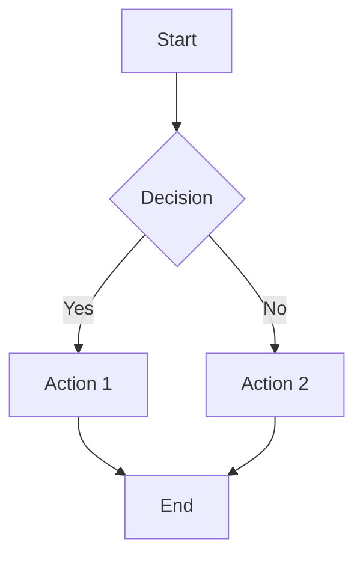

# MarkVista

A professional Markdown preview and export application built with Next.js 16, TypeScript, and Tailwind CSS. Transform your markdown files into beautifully formatted PDF and DOCX documents with full dark mode support.

🔗 **Live Demo**: [https://nomannayeem.github.io/MarkVista](https://nomannayeem.github.io/MarkVista)

## ✨ Features

### 📝 Rich Markdown Rendering
- **GitHub Flavored Markdown (GFM)** support
- Tables, task lists, strikethrough
- **Syntax-highlighted code blocks** with 6 theme options
- **Math equations** with KaTeX (LaTeX syntax)
- **HTML support** via rehype-raw

### 🎨 Modern UI/UX
- **Dark Mode** - Full theme switching (light/dark/system)
- **Syntax Theme Selector** - 6 beautiful code themes:
  - One Dark
  - GitHub (light)
  - VS Code Dark
  - Dracula
  - Atom Dark
  - Tomorrow
- **Table of Contents** - Auto-generated with smooth scrolling
- **Responsive Design** - Mobile-friendly interface
- **Accessibility** - ARIA labels and keyboard navigation

### 📊 Interactive Diagrams
- **Mermaid.js** support for flowcharts, sequence diagrams, mind maps, and more
- **Light backgrounds** on all diagrams for better print/export quality
- Click diagrams to download as PNG images (2x resolution)

### 📄 Professional Export (2025 Standards)
- **PDF Export** - Using html2pdf.js
  - High-quality JPEG output (98% quality, 2x scale)
  - Proper page breaks
  - Light backgrounds enforced
  - A4 format with proper margins

- **DOCX Export** - Using docx library
  - Proper text layers (selectable text)
  - Full formatting support:
    - Headings (H1-H6) with styling
    - Bold, italic, code formatting
    - Tables with proper structure
    - Lists (numbered & bulleted)
    - Blockquotes with indentation
    - Code blocks with monospace font
  - Compatible with Microsoft Word, LibreOffice, Google Docs

- **Print Support** - Browser print (Cmd/Ctrl+P)
  - Hyperlinks preserved with URLs shown
  - Optimized for A4 printing
  - Clean page breaks

## 🚀 Tech Stack

- **Framework:** Next.js 16 with App Router + Turbopack
- **Language:** TypeScript 5 (strict mode)
- **Styling:** Tailwind CSS v4 with PostCSS
- **React:** React 19.2.0
- **Markdown:**
  - react-markdown
  - remark-gfm, remark-math
  - rehype-katex, rehype-raw
- **Diagrams:** Mermaid.js v11.12.1
- **Syntax Highlighting:** react-syntax-highlighter with Prism themes
- **Math Rendering:** KaTeX v0.16.25
- **Theme Management:** next-themes v0.4.0
- **Export Libraries:**
  - PDF: html2pdf.js (browser-based, 2025 standard)
  - DOCX: docx v9.5.1 (professional document generation)
  - Legacy: jsPDF, html2canvas-pro
- **File Handling:** file-saver v2.0.5

## 📦 Getting Started

### Prerequisites

- Node.js 20 or later (required for Next.js 16)
- npm 9+ or pnpm 8+ or yarn 1.22+

### Installation

1. Clone the repository:
```bash
git clone https://github.com/NoManNayeem/MarkVista.git
cd MarkVista
```

2. Install dependencies:
```bash
npm install
```

3. Run the development server:
```bash
npm run dev
```

4. Open [http://localhost:3000](http://localhost:3000) in your browser

### Build for Production

```bash
npm run build   # Build the application
npm start       # Start production server
```

### Linting

```bash
npm run lint    # Run ESLint
```

## 🌐 Deployment to GitHub Pages

This project is configured for static export and GitHub Pages deployment.

### Setup GitHub Pages

1. **Push to GitHub:**
   ```bash
   git remote add origin https://github.com/NoManNayeem/MarkVista.git
   git push -u origin main
   ```

2. **Build and Export:**
   ```bash
   npm run export
   ```
   This creates a static export in the `out/` directory.

3. **Configure GitHub Pages:**
   - Go to your repository settings
   - Navigate to "Pages" section
   - Set source to "GitHub Actions" or deploy from branch
   - The site will be available at `https://nomannayeem.github.io/MarkVista`

### Automated Deployment

The project includes GitHub Actions workflow (`.github/workflows/nextjs.yml`) that automatically:
- Builds the project on push to main
- Exports static files
- Deploys to GitHub Pages

## 📖 Usage

### 1. Upload a Markdown File
- Drag and drop a `.md` or `.markdown` file on the upload page
- Or click to browse and select a file
- Maximum file size: 10MB

### 2. Preview & Customize
- Your markdown renders with full formatting
- Switch between light/dark themes using the theme toggle
- Select your preferred syntax highlighting theme
- Use the Table of Contents for easy navigation
- Diagrams render automatically
- Math equations display beautifully

### 3. Export
- **Export PDF** - High-quality PDF with light backgrounds
- **Export DOCX** - Word document with selectable text
- **Print** (Cmd/Ctrl+P) - Browser print with preserved hyperlinks
- **Download Diagrams** - Click any Mermaid diagram to save as PNG

## 📝 Markdown Best Practices & Styling Rules

### Supported Markdown Features

MarkVista supports GitHub Flavored Markdown (GFM) with extensive features:

#### Text Formatting
- **Bold**: `**bold text**` or `__bold text__`
- *Italic*: `*italic text*` or `_italic text_`
- ***Bold Italic***: `***bold italic***`
- ~~Strikethrough~~: `~~strikethrough text~~`
- `Inline code`: `` `code` ``

#### Headings
```markdown
# H1 Heading
## H2 Heading
### H3 Heading
#### H4 Heading
##### H5 Heading
###### H6 Heading
```

#### Lists
```markdown
- Unordered item
- Another item
  - Nested item

1. Ordered item
2. Second item
3. Third item

- [x] Completed task
- [ ] Incomplete task
```

#### Code Blocks
```markdown
Inline `code` here.

```javascript
// Code block with syntax highlighting
function hello() {
  console.log("Hello, World!");
}
```
```

#### Tables
```markdown
| Header 1 | Header 2 | Header 3 |
|----------|----------|----------|
| Cell 1   | Cell 2   | Cell 3   |
| Cell 4   | Cell 5   | Cell 6   |
```

#### Blockquotes
```markdown
> This is a blockquote
> It can span multiple lines
```

#### Links & Images
```markdown
[Link text](https://example.com)

```

#### Mermaid Diagrams
```markdown

```

Supported diagram types:
- Flowcharts
- Sequence diagrams
- Class diagrams
- State diagrams
- Entity-relationship diagrams
- User journey diagrams
- Gantt charts
- Pie charts
- Mind maps
- And more!

#### Math Equations
```markdown
Inline math: $E = mc^2$

Block math:
$$
\int_{-\infty}^{\infty} e^{-x^2} dx = \sqrt{\pi}
$$
```

## 🎨 Features in Detail

### Dark Mode
- System-aware theme (respects OS preference)
- Manual toggle (light/dark/system)
- Smooth transitions
- Persists user preference
- Dark mode for all components including:
  - Code blocks
  - Tables
  - Diagrams
  - Modals

### Syntax Highlighting
- 6 beautiful themes to choose from
- Proper color contrast in both light/dark modes
- Supports 100+ programming languages
- Theme preference saved to localStorage

### Table of Contents
- Automatically generated from H1-H6 headings
- Smooth scroll to sections
- Active section highlighting
- Mobile-friendly overlay
- Desktop floating sidebar

### Export Quality
- **PDF**: JPEG-based, high quality (98%), 2x scale, proper page breaks
- **DOCX**: Text-based (selectable), proper formatting, Word-compatible
- **Print**: Optimized for A4, hyperlinks shown as URLs

### Error Handling
- Graceful error messages
- Success/failure notifications
- Console logging for debugging
- Fallback mechanisms

## 📁 Project Structure

```
MarkVista/
├── .github/
│   └── workflows/
│       └── nextjs.yml          # GitHub Actions deployment
├── src/
│   ├── app/
│   │   ├── layout.tsx          # Root layout with theme provider
│   │   ├── page.tsx            # Upload/home page
│   │   ├── preview/
│   │   │   └── page.tsx        # Preview page with exports
│   │   ├── globals.css         # Global styles & dark mode
│   │   └── print.css           # Print-specific styles
│   ├── components/
│   │   ├── MarkdownPreview.tsx # Main preview component
│   │   ├── ThemeProvider.tsx   # next-themes wrapper
│   │   ├── ThemeToggle.tsx     # Dark mode toggle
│   │   ├── SyntaxThemeSelector.tsx # Syntax theme picker
│   │   ├── TableOfContents.tsx # Auto-generated TOC
│   │   ├── Navbar.tsx          # Navigation bar
│   │   ├── Footer.tsx          # Footer component
│   │   └── GitHubStarModal.tsx # Star request modal
│   └── lib/
│       ├── exportPDF.ts        # Legacy PDF export (jsPDF)
│       ├── exportPDFImproved.ts   # New PDF export (html2pdf.js)
│       ├── exportDOCX.ts       # Legacy DOCX export
│       └── exportDOCXImproved.ts  # New DOCX export (docx library)
├── public/
│   ├── test.md                 # Sample markdown file
│   └── .nojekyll               # GitHub Pages config
├── next.config.ts              # Next.js configuration
├── tailwind.config.ts          # Tailwind CSS v4 config
└── package.json                # Dependencies
```

## 🌍 Browser Support

- **Chrome** 90+
- **Firefox** 88+
- **Safari** 14+
- **Edge** 90+
- Mobile browsers (iOS Safari 14+, Chrome Mobile)

## 🔧 Configuration

### Environment Variables
No environment variables required for basic functionality.

### Next.js Config
```typescript
// next.config.ts
const config: NextConfig = {
  output: 'export',  // Static export for GitHub Pages
  basePath: '/MarkVista',  // GitHub Pages base path
  images: { unoptimized: true },  // Required for static export
};
```

### Tailwind CSS v4
Using the new Tailwind CSS v4 with PostCSS configuration.

## 🧪 Testing

A comprehensive sample markdown file is included at `public/test.md` for testing:
- Text formatting (bold, italic, strikethrough)
- All heading levels
- Lists (ordered, unordered, nested, task lists)
- Tables with various column widths
- Code blocks with syntax highlighting
- Mermaid diagrams (flowchart, sequence, etc.)
- Math equations (inline and block)
- Blockquotes
- Links and images

## 🐛 Known Limitations

1. **PDF Export**: Text is not selectable (rendered as JPEG image)
2. **DOCX Export**: Complex CSS animations/transitions not supported
3. **Mermaid**: Very large diagrams may not fit on one page
4. **File Size**: Markdown files limited to 10MB

## 🤝 Contributing

Contributions are welcome! Please feel free to submit a Pull Request.

1. Fork the repository
2. Create your feature branch (`git checkout -b feature/AmazingFeature`)
3. Commit your changes (`git commit -m 'Add some AmazingFeature'`)
4. Push to the branch (`git push origin feature/AmazingFeature`)
5. Open a Pull Request

### Development Guidelines
- Follow TypeScript strict mode
- Use ESLint and Prettier
- Write descriptive commit messages
- Test on multiple browsers
- Ensure dark mode compatibility

## 📄 License

This project is licensed under the MIT License - see the LICENSE file for details.

## 🙏 Acknowledgments

- Next.js team for the amazing framework
- Tailwind CSS for the utility-first CSS framework
- Mermaid.js for diagram rendering
- KaTeX for math rendering
- All open-source contributors

## ⭐ Show Your Support

If you find MarkVista useful, please consider:
- Giving it a star on GitHub ⭐
- Sharing it with others
- Contributing to the project
- Reporting bugs or suggesting features

## 📧 Contact

**NoManNayeem** - [GitHub Profile](https://github.com/NoManNayeem)

Project Link: [https://github.com/NoManNayeem/MarkVista](https://github.com/NoManNayeem/MarkVista)

---

**Built with Next.js 16, TypeScript, and Tailwind CSS v4**
Made with ❤️ by [NoManNayeem](https://github.com/NoManNayeem)
