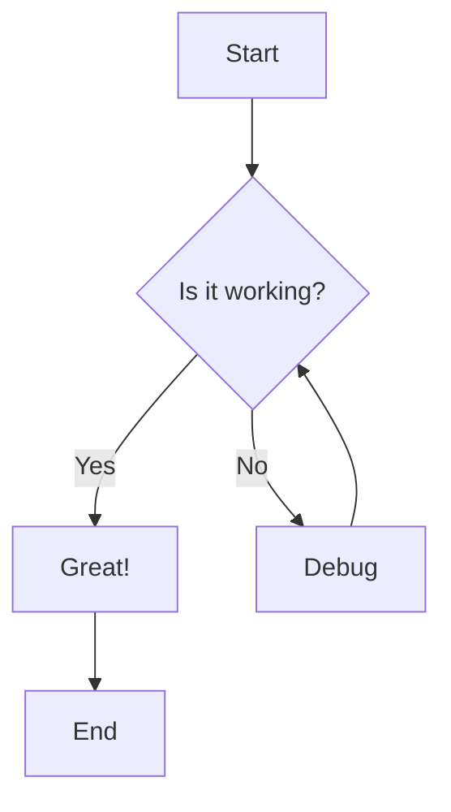
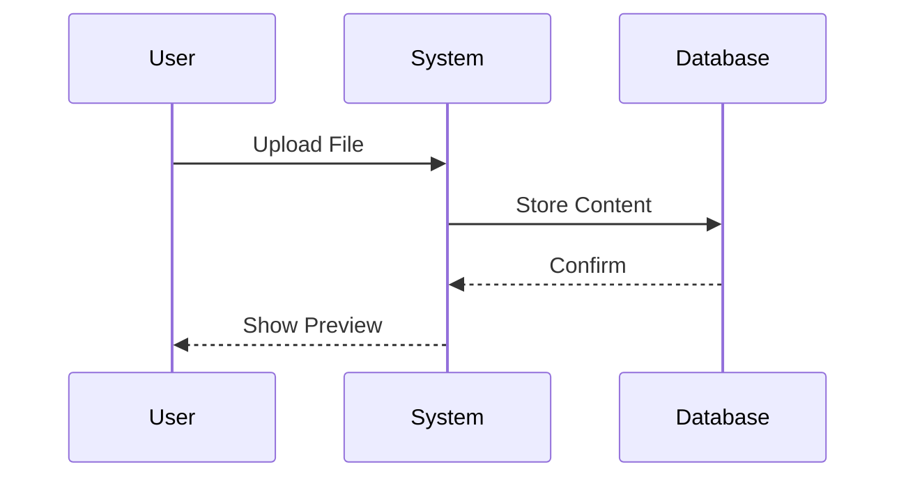
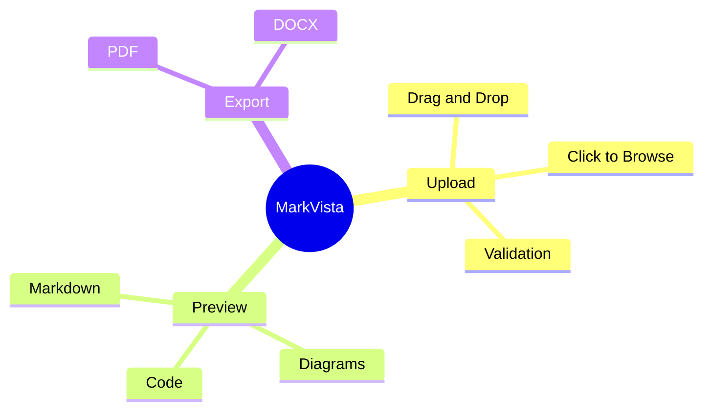

# MarkVista Test Document

## Features Demo

### 1. Text Formatting

This is **bold text** and this is *italic text*. You can also have ***bold and italic***.

Here's a ~~strikethrough~~ example.

### 2. Lists

**Unordered List:**
- Item 1
- Item 2
  - Nested item 2.1
  - Nested item 2.2
- Item 3

**Ordered List:**
1. First step
2. Second step
3. Third step

**Task List:**
- [x] Completed task
- [ ] Pending task
- [ ] Another pending task

### 3. Code Blocks

Inline code: `const hello = "world";`

JavaScript code block:
```javascript
function greet(name) {
  console.log(`Hello, ${name}!`);
  return `Welcome to MarkVista`;
}

greet("Developer");
```

Python code block:
```python
def calculate_sum(numbers):
    """Calculate sum of list"""
    return sum(numbers)

result = calculate_sum([1, 2, 3, 4, 5])
print(f"Sum: {result}")
```

### 4. Tables

| Feature | Supported | Notes |
|---------|-----------|-------|
| Markdown | ✅ | Full GFM support |
| Diagrams | ✅ | Mermaid.js |
| Export PDF | ✅ | High quality |
| Export DOCX | ✅ | Compatible |

### 5. Blockquotes

> This is a blockquote.
> It can span multiple lines.
> 
> — Author Name

### 6. Links and Images

[Visit OpenAI](https://openai.com)

### 7. Math Equations

Inline math: $E = mc^2$

Block math:
$$
\int_{-\infty}^{\infty} e^{-x^2} dx = \sqrt{\pi}
$$

### 8. Flowchart Diagram



### 9. Sequence Diagram



### 10. Mind Map



---

## Conclusion

This test document demonstrates all major features of MarkVista!

